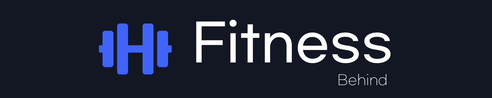
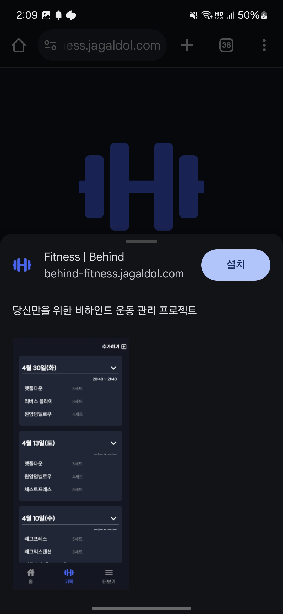

# fitness | Behind



당신만을 위한 비하인드 운동 관리 프로젝트 **Behind Fitness**입니다.

## [Live Demo](https://behind-fitness.jagaldol.com/)

<p align="center">
    
    
</p>

### Installation

1. 모바일에서 `Chrome`(권장)으로 [https:///behind-fitness.jagaldol.com](https:///behind-fitness.jagaldol.com) 접속
2. 브라우저 메뉴에서 `홈화면에 추가` 선택

<p align="center">
    
    
</p>
3. 앱 설치
<p align="center">
    
    
</p>

> 함께 사용하고 싶은 분은 문의 부탁드립니다.
>
> 서버 한도 내에서 아이디를 발급해드릴 수 있습니다.

## Getting Started

### Run Backend Server with Docker

이 프로젝트는 페이지에 로그인이 필요하므로, 개발을 위해서는 백엔드 서버가 필요합니다. 아래의 방법을 통해 `docker compose`로 백엔드 서버를 쉽게 실행할 수 있습니다.

```sh
$ docker compose up -d
```

실행 시 아래의 두 컨테이너가 실행됩니다.

- **backend**: `Spring Boot` 서버가 로컬 환경에서 `8080`포트로 실행됩니다.
- **redis**: `Refresh Token`을 위한 `in-memory DB`로 `6379` 포트에서 실행됩니다.

> 백엔드 서버에 대한 자세한 내용은 [백엔드 레포지토리](https://github.com/jagaldol/behind-fitness-server)에서 확인하세요.

### Install Dependencies

```sh
$ npm install
```

### Run Next.js App

```sh
$ npm run dev
```

`next.js`가 실행되고 나면, [http://localhost:3000](http://localhost:3000)에서 애플리케이션을 확인할 수 있습니다.
